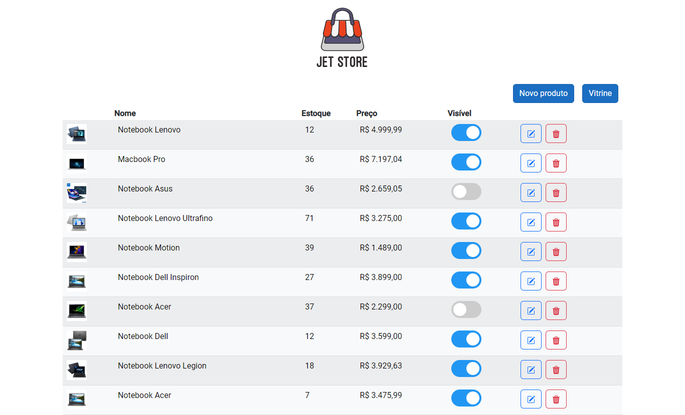
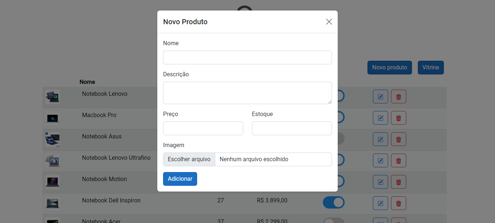
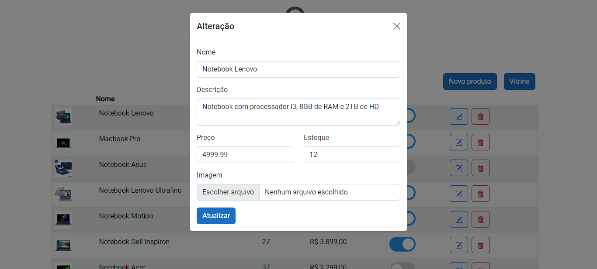
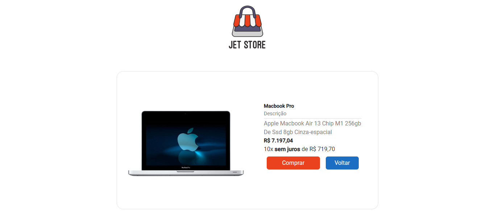

# Projeto - CRUD de produtos

## Listagem de produtos

## Adicionar produtos

## Atualizar produtos

## Vitrine de produtos

## Detalhes do produto

# APP

Projeto gerado com [Angular CLI](https://github.com/angular/angular-cli) version 12.0.2.

## NPM

- npm i: Instalar módulos e dependências do NPM (pasta node_modules)

## RUN

- ng serve

# API

## Migrations

* Pode ser necessário remover a pasta "Migrations" para evitar conflitos

- dotnet ef migrations add Initial: Criar a Migrations (necessário package Microsoft.EntityFrameworkCore.Tools);
- dotnet ef database update: Aplicar a Migrations para o Banco de Dados

## RUN

- dotnet run
